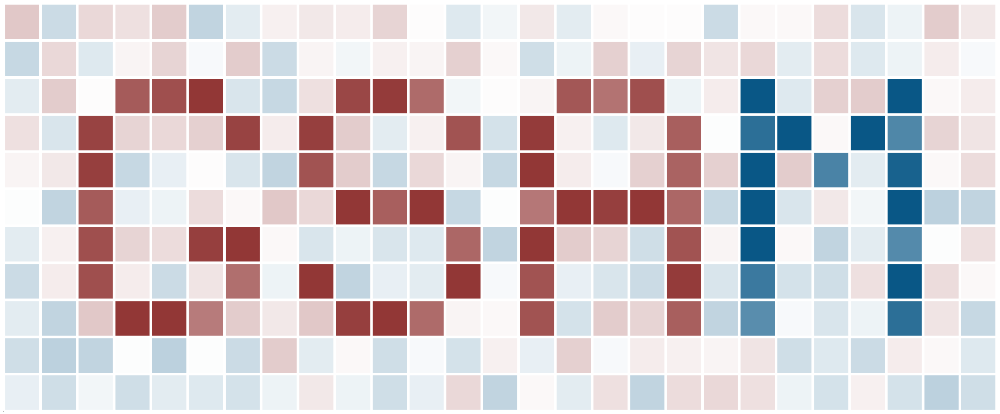

# Gene Set Analysis Matlab (GSAM)

Gene set analysis (GSA) and visualization of results. This package was inspired by (and based on) the [Piano package for R](https://bioconductor.org/packages/release/bioc/html/piano.html).

## [User guide](userguide.md)

See the [user guide](userguide.md) for some examples on using GSAM.

## Package contents

### Run a gene set analysis (GSA)
* [`geneSetAnalysis`](https://github.com/JonathanRob/GeneSetAnalysisMatlab/blob/master/geneSetAnalysis.m) - Run GSA

### Gene set collection (GSC) import/export
* [`importGSC`](https://github.com/JonathanRob/GeneSetAnalysisMatlab/blob/master/importGSC.m) - Import gene set collection (GSC) from a [.gmt](https://software.broadinstitute.org/cancer/software/gsea/wiki/index.php/Data_formats#GMT:_Gene_Matrix_Transposed_file_format_.28.2A.gmt.29) file.
* [`exportGSC`](https://github.com/JonathanRob/GeneSetAnalysisMatlab/blob/master/exportGSC.m) - Export a GSC to a .gmt or .txt file.
* [`extractMetaboliteGSC`](https://github.com/JonathanRob/GeneSetAnalysisMatlab/blob/master/extractMetaboliteGSC.m) - Extract metabolite gene sets from a genome-scale model.
* [`extractSubsystemGSC`](https://github.com/JonathanRob/GeneSetAnalysisMatlab/blob/master/extractSubsystemGSC.m) - Extract subsystem gene sets from a genome-scale model.
* [`updateHumanGMTs`](https://github.com/JonathanRob/GeneSetAnalysisMatlab/blob/master/updateHumanGMTs.m) - Generate several `.gmt` files from Human-GEM model.

### Visualization of results
* [`GSAheatmap`](https://github.com/JonathanRob/GeneSetAnalysisMatlab/blob/master/GSAheatmap.m) - Produce heatmap of single or multiple GSA results.
* [`genHeatMap`](https://github.com/JonathanRob/GeneSetAnalysisMatlab/blob/master/genHeatMap.m) - Generic heatmap function (used by `GSAheatmap`).
* [`genHeatScatter`](https://github.com/JonathanRob/GeneSetAnalysisMatlab/blob/master/genHeatScatter.m) - Generic heatscatter function.

### Additional functions
* [`adjust_pvalues`](https://github.com/JonathanRob/GeneSetAnalysisMatlab/blob/master/adjust_pvalues.m) - Adjust p-values for false discovery rate (FDR) (used by `geneSetAnalysis`).
* [`custom_cmap`](https://github.com/JonathanRob/GeneSetAnalysisMatlab/blob/master/custom_cmap.m) - Create or load a custom colormap (used by heatmap functions).
* [`modifyOptSettings`](https://github.com/JonathanRob/GeneSetAnalysisMatlab/blob/master/modifyOptSettings.m) - Helper function for assigning optional parameters.

## Citation

_Manuscript in preparation._

