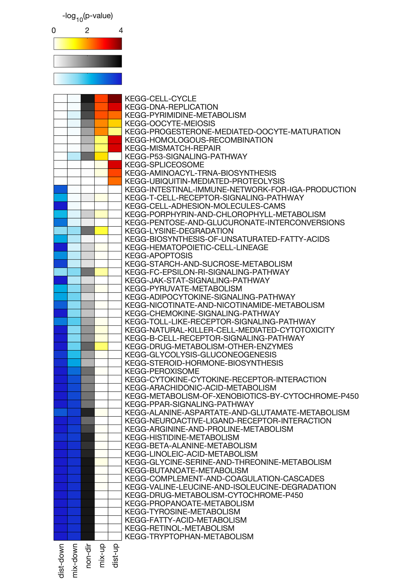
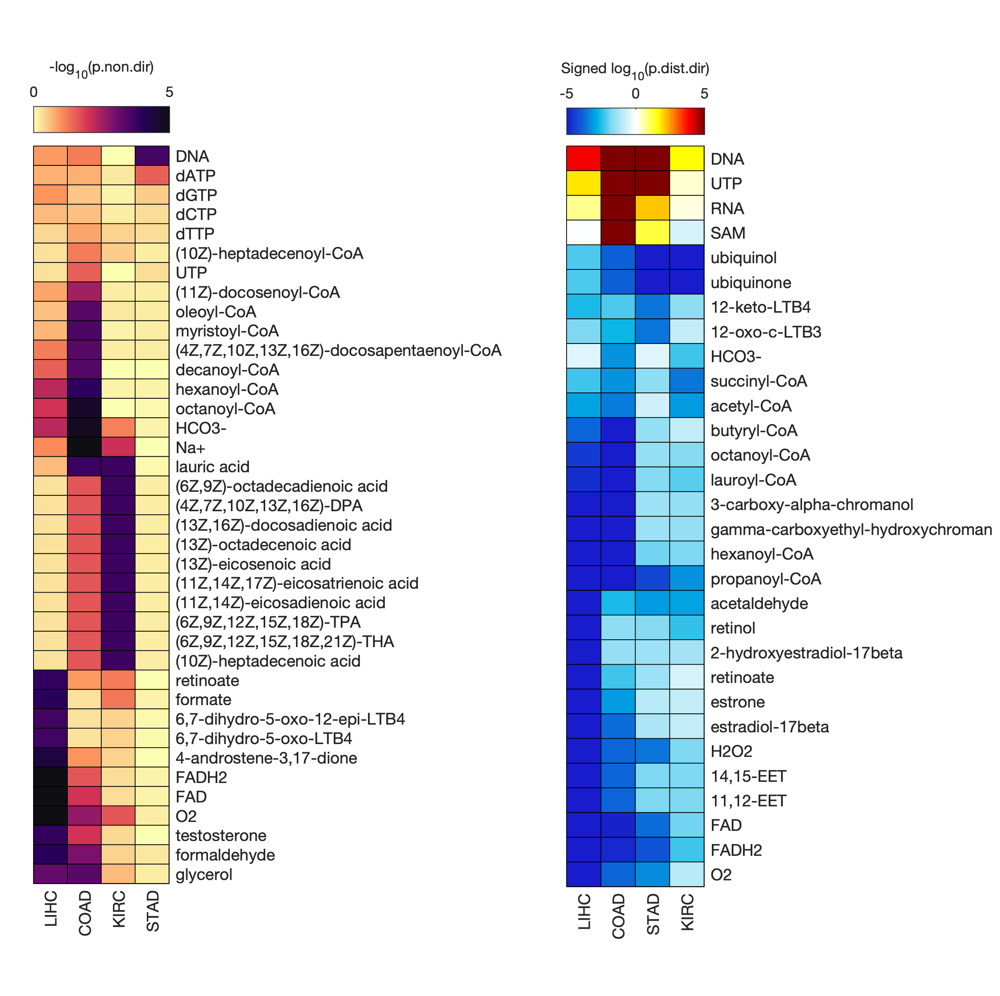

# GSAM User Guide

The following examples demonstrate the use of the GSAM package for common analysis scenarios.

The data files used for these examples can be retrieved from the `data/` directory on the associated [documentation repository](https://github.com/JonathanRob/GeneSetAnalysisMatlab-doc/tree/master/data). If you wish you run these examples yourself, first download the files in that directory to your local machine and ensure that they are on your current MATLAB path.

## 1. Single GSA, Liver hepatocellular carcinoma

### 1.1. Load the data and gene set collection file

Load the differential expression (DE) results for hepatocellular carcinoma (LIHC) (paired-normal tissue vs. primary tumor tissue).
```matlab
DEdata = readtable('DEresults_LIHC.txt');
```

Take a look at the table contents.
```matlab
head(DEdata)

% ans =
% 
%   8×4 table
% 
%          gene_IDs           gene_names       logFC         PValue  
%     ___________________    ____________    __________    __________
% 
%     {'ENSG00000000003'}    {'TSPAN6'  }      -0.26345      0.050906
%     {'ENSG00000000419'}    {'DPM1'    }    -0.0030857       0.97084
%     {'ENSG00000000457'}    {'SCYL3'   }      0.044663       0.63024
%     {'ENSG00000000460'}    {'C1orf112'}        0.7297    0.00021919
%     {'ENSG00000000938'}    {'FGR'     }       -1.2409    3.6644e-15
%     {'ENSG00000000971'}    {'CFH'     }      -0.72639    0.00069828
%     {'ENSG00000001036'}    {'FUCA2'   }      0.050749       0.66557
%     {'ENSG00000001084'}    {'GCLC'    }      -0.60349    1.1461e-06
```

Extract the data into individual variables
```matlab
geneIDs   = DEdata.gene_IDs;     % gene Ensembl IDs
geneNames = DEdata.gene_names;   % gene abbreviations
log2FC    = DEdata.logFC;        % log2(fold-changes) (normal vs. tumor)
pvals     = DEdata.PValue;       % fold-change significance (p-values)
```

Load the `KEGG_GSC.gmt` gene set collection (GSC) file using the `importGSC` function, and look at the first few lines to see how it's formatted.
```matlab
gsc = importGSC('KEGG_GSC.gmt');

% Gene set collection contains 146 gene sets and 4966 unique genes.

gsc(1:5,:)

% ans =
%
%   5×2 cell array
%
%     {'KEGG-GLYCOLYSIS-GLUCONEOGENESIS'}    {'ACSS2'}
%     {'KEGG-GLYCOLYSIS-GLUCONEOGENESIS'}    {'GCK'  }
%     {'KEGG-GLYCOLYSIS-GLUCONEOGENESIS'}    {'PGK2' }
%     {'KEGG-GLYCOLYSIS-GLUCONEOGENESIS'}    {'PGK1' }
%     {'KEGG-GLYCOLYSIS-GLUCONEOGENESIS'}    {'PDHB' }
```

!!! note
	The `KEGG_custom_GSC.gmt` file used in this example is a modified version of the KEGG gene set collection retrieved from [MSigDB](http://software.broadinstitute.org/gsea/msigdb/genesets.jsp?collection=CP:KEGG), where all disease-related gene sets were removed.


### 1.2. Run the gene set analysis

Run the gene set analysis using the `geneSetAnalysis` function.
```matlab
GSAres = geneSetAnalysis(geneNames, pvals, log2FC, gsc, 'Wilcoxon', 50000, [20, Inf]);

% Gene set collection contains 146 gene sets and 4966 unique genes.
% Checking for empty gene sets... Removed 0 empty sets.
% Checking for duplicated rows in GSC... Removed 0 duplicated rows.
% Checking gene set sizes... Removed 27 gene sets not satisfying size limits.
% Final number of gene sets remaining: 119
% Subsetting data for mixed-directional calculations... Done.
% Calculating test statistic... Done.
% Calculating significance via gene shuffling... Done.
```
Here, we chose the Wilcoxon rank-sum test as the method for combining gene-level statistics, set the number of permutations for significance calculation to 50000, and excluded gene sets that contained less than 20 genes.

!!! important
	We used `geneNames` (instead of e.g. `geneIDs`) as input to the `geneSetAnalysis` function because gene names are used in the `gsc` that was loaded. It is important that the gene names or IDs in the gene list are of the same type as those used in the GSC file.


### 1.3. View and/or export the results

The results are returned as the `GSAres` table, which contains information about the size (number of genes) and significance (p-values, raw and adjusted) for each of the evaluated gene sets. The table can be viewed by double-clicking on `GSAres` in the Workspace, or using the `open` function.
```matlab
open('GSAres');
```

| GS_name &nbsp; &nbsp; &nbsp; &nbsp; &nbsp; &nbsp; &nbsp; &nbsp; &nbsp; &nbsp; &nbsp; &nbsp; &nbsp; &nbsp; &nbsp; &nbsp; &nbsp; &nbsp; &nbsp; &nbsp; &nbsp; &nbsp; &nbsp; &nbsp; &nbsp; &nbsp; &nbsp; &nbsp; &nbsp; &nbsp; &nbsp; &nbsp; &nbsp; &nbsp; &nbsp; &nbsp; &nbsp; &nbsp; | GS_size | stat_nondir | p_nondir | padj_nondir | stat_mixup | p_mixup | padj_mixup | stat_mixdn | p_mixdn | padj_mixdn | stat_distup | p_distup | padj_distup | stat_distdn | p_distdn | padj_distdn |
| ------- | ------- | ------- | ------- | ------- | ------- | ------- | ------- | ------- | ------- | ------- | ------- | ------- | ------- | ------- | ------- | ------- |
| KEGG-GLYCOLYSIS-GLUCONEOGENESIS | 51 | 519848 | 0.0102 | 0.0371 | 62259 | 0.5766 | 0.8788 | 196844 | 0.0018 | 0.0092 | 302878 | 0.9998 | 1 | 571415 | 0.00018 | 0.00067 |
| KEGG-CITRATE-CYCLE-TCA-CYCLE | 30 | 294717 | 0.0832 | 0.1799 | 44790 | 0.3987 | 0.8041 | 101736 | 0.0759 | 0.1966 | 200384 | 0.9817 | 1 | 313906 | 0.0183 | 0.0496 |
| KEGG-PENTOSE-PHOSPHATE-PATHWAY | 21 | 198224 | 0.2115 | 0.3872 | 47870 | 0.2579 | 0.6929 | 51476 | 0.3019 | 0.5239 | 176522 | 0.5622 | 1 | 183481 | 0.4379 | 0.6596 |
| KEGG-PENTOSE-AND-GLUCURONATE-INTERCONVERSIONS | 21 | 189170 | 0.3415 | 0.5080 | 8507 | 0.8360 | 0.9871 | 84792 | 0.2356 | 0.4344 | 103850 | 0.9998 | 1 | 256153 | 0.0002 | 0.0007 |
| KEGG-FRUCTOSE-AND-MANNOSE-METABOLISM | 32 | 278495 | 0.4365 | 0.6076 | 74220 | 0.2803 | 0.6948 | 65609 | 0.6202 | 0.8317 | 283091 | 0.3800 | 1 | 265485 | 0.6201 | 0.8580 |
| ... | ... | ... | ... | ... | ... | ... | ... | ... | ... | ... | ... | ... | ... | ... | ... | ... |


The tabular format of the GSA results can often be difficult to interpret. A more intuitive way to visualize the results is to use a heatmap. Generate a heatmap to visualize `GSAres` using the `GSAheatmap` function.
```matlab
GSAheatmap(GSAres, true, 'pval', 0.01);
```


Here, we chose to use the adjusted gene-set p-values (as specified with the second input `true`), and filtered the gene sets to only show those with an adjusted p-value ≤ 0.01 for at least one of the five directionality types.

!!! note
	For more information on the meaning and interpretation of the different p-value classes (distinct directional down and up, mixed-directinal down and up, and non-directional), see the [publication](https://www.ncbi.nlm.nih.gov/pubmed/23444143) where they were introduced. 

Alternatively, the results can be written to a file.
```matlab
writetable(GSAres,'GSAresults.txt','Delimiter','\t');  % export to tab-delimited .txt file
writetable(GSAres,'GSAresults.csv','Delimiter',',');  % export to comma-delimited .csv file
```


## 2. Using gene set collections derived from GEMs

Genome-scale metabolic models (GEMs) are convenient collections of all known reactions comprising the metabolism of an organism or cell type. Since most GEMs contain gene information, we can extract gene set collections from the associations of these genes with other model components, such as metabolites or subsystems (pathways).

### 2.1. Extract and use a metabolite-based GSC

For this example, we will use a human genome-scale metabolic model, Human-GEM. A `.mat` version of the model can be retrieved from the [Human-GEM GitHub repository](https://github.com/SysBioChalmers/Human-GEM/tree/master/ModelFiles/mat).

Once the `HumanGEM.mat` file is downloaded and added to the current working folder (or somewhere else on the MATLAB path), load it into MATLAB.
```matlab
load('HumanGEM.mat');  % the model is loaded as a structure named 'ihuman'
```

Extract a metabolite-based GSC from the model using the `extractMetaboliteGSC` function.
```matlab
gsc_met = extractMetaboliteGSC(ihuman);

% Gene set collection contains 3715 gene sets and 3625 unique genes.
```

Just as other GSCs (such as the KEGG collection described above) associate biological functions or processes to sets of genes, the metabolite GSC associates metabolites to sets of genes. This provides a convenient link between gene-level information and metabolism.

Use the same LIHC DE data as was used in Example 1 above:
```matlab
DEdata = readtable('DEresults_LIHC.txt');

geneIDs   = DEdata.gene_IDs;
geneNames = DEdata.gene_names;
log2FC    = DEdata.logFC;
pvals     = DEdata.PValue;
```

Run a GSA with the LIHC DE data, now using the metabolite GSC `gsc_met`.

```matlab
GSAres = geneSetAnalysis(geneIDs, pvals, log2FC, gsc_met, 'Reporter', 50000, [20, 200]);

% Checking for empty gene sets... Removed 71 empty sets.
% Checking for duplicated rows in GSC... Removed 0 duplicated rows.
% Checking gene set sizes... Removed 3236 gene sets not satisfying size limits.
% Final number of gene sets remaining: 408
% Subsetting data for mixed-directional calculations... Done.
% Calculating test statistic... Done.
% Calculating significance via gene shuffling... Done.
```

!!! note
	This approach of using metabolite-based gene sets with the "reporter" method for combining gene-level statistics is termed [*reporter metabolite analysis*](https://www.pnas.org/content/102/8/2685).

!!! important
	Notice that we used the `geneIDs` here instead of `geneNames`. This is because the Human-GEM model by default uses gene Ensembl IDs, which means the `gsc_met` will also contain Ensembl IDs. Try running the GSA using `geneNames` instead - you should see an error.

The results can again be visualized using the `GSAheatmap` function. Since a very large number of gene sets in this example exhibit a low p-value (e.g., < 0.001) we use the `top each` option to only include the top 10 most significant gene sets for each p-value type in the heatmap.
```matlab
GSAheatmap(GSAres, true, 'top each', 10, 5);
```

Note that we set the `colorMax` input to 5 to prevent the color range from autoscaling to the maximum -log10(p-value), resulting in very faint colors for most gene sets.


### 2.2. Extract and use a subsystem-based GSC

In the same way that a metabolite-based GSC can be extracted from a genome-scale model, we can generate a subsystem-based GSC:

```matlab
gsc_subsys = extractSubsystemGSC(ihuman);
```

Subsystems are groups of reactions forming a pathway or sharing a common metabolic function. A few examples can be seen from `gsc_subsys`:

```matlab
subsystem_list = unique(gsc_subsys);
subsystem_list(1:5)

% ans =
% 
%   5×1 cell array
% 
%     {'Acyl-CoA hydrolysis'                        }
%     {'Acylglycerides metabolism'                  }
%     {'Alanine, aspartate and glutamate metabolism'}
%     {'Amino sugar and nucleotide sugar metabolism'}
%     {'Aminoacyl-tRNA biosynthesis'                }
```

Run a GSA on the LIHC DE results with the same settings as above, but now using `gsc_subsys`.
```matlab
GSAres = geneSetAnalysis(geneIDs, pvals, log2FC, gsc_subsys, 'Reporter', 50000, [20, 200]);
```

Visualize the results with a heatmap, filtering based on (adjusted) p-values.
```matlab
GSAheatmap(GSAres, true, 'pval', 0.05, 5);
```


## 3. Combining the results of multiple GSAs

In some cases we have multiple sets of p-values and fold-changes from multiple DE analyses, and may want to compare the GSA results among these data sets. Both the `geneSetAnalysis` and `GSAheatmap` functions allow input of multiple datasets or results.

We will demonstrate two example approaches for running and comparing multiple GSAs which yield the same result. The examples will use the metabolite GSC from the Human-GEM model, and the "Reporter" method for combining statistics. Both approaches begin with the same steps of loading a GSC and specifying the list of dataset files:

```matlab
% extract a metabolite GSC (see Example 2 for more detail)
load('HumanGEM.mat');
gsc_met = extractMetaboliteGSC(ihuman);
```

```matlab
% specify list of DE data files to analyze
cancer_types = {'COAD'; 'KIRC'; 'LIHC'; 'STAD'};
fnames = strcat('DEresults_', cancer_types, '.txt');

% fnames =
% 
%   4×1 cell array
% 
%     {'DEresults_COAD.txt'}
%     {'DEresults_KIRC.txt'}
%     {'DEresults_LIHC.txt'}
%     {'DEresults_STAD.txt'}
```

### 3.1. Run multiple GSAs separately and combine the results

One approach is to run each GSA separately (e.g., in a for-loop), and then combine the results before calling the `GSAheatmap` function.

```matlab
% load and analyze each dataset individually
for i = 1:numel(fnames)
    DEdata = readtable(fnames{i});
    GSAres{i} = geneSetAnalysis(DEdata.gene_IDs, DEdata.PValue, DEdata.logFC, ...
        gsc_met, 'Reporter', 10000, [20, 200]);
    GSAres{i}.Properties.Description = cancer_types{i};  % label the table as the cancer type
end
```

### 3.2. Run multiple GSAs together in one function call

Another approach is to first combine the datasets, and then supply the combined data to the `geneSetAnalysis` function.

```matlab
% load and combine datasets into cell arrays
for i = 1:numel(fnames)
    DEdata = readtable(fnames{i});
    logFC{i} = DEdata.logFC;
    PValue{i} = DEdata.PValue;
    genes{i} = DEdata.gene_IDs;
end

% run the GSA
GSAres = geneSetAnalysis(genes, PValue, logFC, gsc_met, 'Reporter', ...
    10000, [20, 200], 'p', cancer_types);


% ##### Running GSA on COAD (run 1 of 4) #####
% 
% Checking for empty gene sets... Removed 106 empty sets.
% Checking for duplicated rows in GSC... Removed 0 duplicated rows.
% Checking gene set sizes... Removed 3250 gene sets not satisfying size limits.
% Final number of gene sets remaining: 359
% Subsetting data for mixed-directional calculations... Done.
% Calculating test statistic... Done.
% Calculating significance via gene shuffling... Done.
%
%
% ##### Running GSA on KIRC (run 2 of 4) #####
% 
% Checking for empty gene sets... Removed 63 empty sets.
% Checking for duplicated rows in GSC... Removed 0 duplicated rows.
% Checking gene set sizes... Removed 3288 gene sets not satisfying size limits.
% Final number of gene sets remaining: 364
% Subsetting data for mixed-directional calculations... Done.
% Calculating test statistic... Done.
% Calculating significance via gene shuffling... Done.
% 
% ...
```

Note that in this second approach, we supplied the dataset names `cancer_types` as input to the `geneSetAnalysis` function.


### 3.3. Generate multi-GSA heatmaps

Both the above approaches should yield essentially the same `GSAres` result (though not identical because of stochasticity). To visualize the results of the multiple GSAs in the same plot, the `GSAheatmap` function can be used.

Here we choose to show the top 10 most significant gene sets (metabolites) from each dataset, and to scale the colorbar to a maximum -log<sub>10</sub>(p-value) of 5.

```matlab
GSAheatmap(GSAres, true, 'top each', 10, 5);

% Warning! The following gene sets are not present in all GSAres tables and will therefore be ignored:
% 	1,2-diacylglycerol-LD-SM pool
% 	1-(1-alkenyl)-sn-glycero-3-phosphoethanolamine
% 	1-acylglycerol-3P pool
% 	10-HETE
% 	11,12,15-THETA
% 	...and 70 more.
```



Two heatmaps are produced: one showing the non-directional p-values (left), and one showing the distinct-direcitonal p-values (right). The distinct-directional p-values have been signed (+/-) after log-transformation, based on which direction (increase or decrease) was more significant.

!!! important
	From the warning message, we see that some gene sets (metabolites) cannot be shown because they are not present in all GSA results across the different runs. This occurs because the different datasets each have a different gene list (usually due to filtering of low-count genes). When genes that are absent from the dataset are removed from the GSC in the pre-processing step, the gene set sizes may change and some gene sets may no longer satisfy the 20-200 range that was specified in the input.


