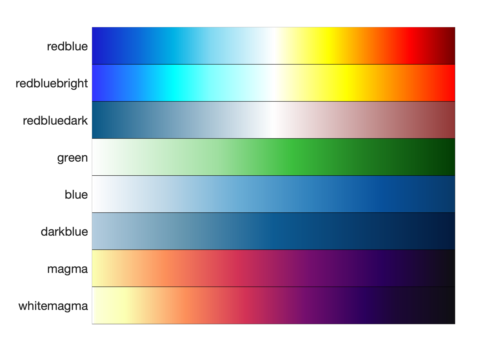

# Visualization

A few of the visualization functions in the GSAM package can be used for general purposes (i.e., unrelated to gene set analysis). These functions are described below.

## Colormaps

MATLAB does not always have the best color palettes (colormaps) available. We therefore provide the [`custom_cmap`](https://github.com/JonathanRob/GeneSetAnalysisMatlab/blob/master/custom_cmap.m) function to allow users to more easily create their own custom colormap, or to choose from several of our own pre-made custom colormaps.

A preview of our built-in custom colormaps is available:
```matlab
custom_cmap('preview');
```



## Heatmap

The [`genHeatMap`](https://github.com/JonathanRob/GeneSetAnalysisMatlab/blob/master/genHeatMap.m) function generates a heatmap for a numeric matrix. The rows and/or columns can be optionally clustered/reordered based on a specified distance metric (e.g., Euclidean, cosine, spearman, etc.).

```matlab
data = randn(10, 30);  % create a matrix of random values for demonstration purposes
genHeatMap(data);  % generate heatmap using all defaults

```


## Heatscatter

The [`genHeatScatter`](https://github.com/JonathanRob/GeneSetAnalysisMatlab/blob/master/genHeatScatter.m) function generates a heatmap for **two** equally sized matrices, where one matrix defines the cell colors and the other matrix defines the cell sizes (cells are circles rather than squares). The rows and/or columns can be clustered based on the color matrix, the size matrix, or an average of the two matrices (after normalization).

```matlab
data = randn(10, 30);  % create a matrix of random values for demonstration purposes
genHeatMap(data, data);  % generate heatscatter using same data for both size and color

```


